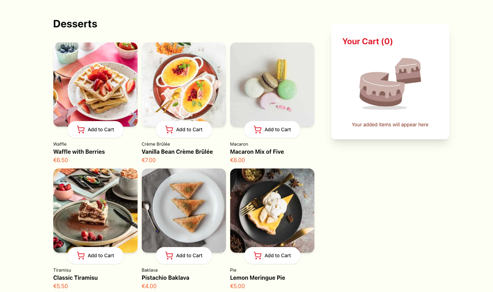

<div align="center">



# 🍰 DESSERT SHOP  
### **Sweet. Simple. Scalable.**

Application e-commerce front-end moderne permettant d’afficher des produits et gérer un panier interactif.

✅ Catalogue dynamique de desserts  
✅ Gestion du panier en temps réel  
✅ Interface moderne & responsive  
✅ Infrastructure AWS automatisée  

</div>

---

## 🏗️ Architecture


---

## 🎯 Objectif

Créer une application e-commerce simple et performante permettant aux utilisateurs de :

- Visualiser une liste de produits  
- Ajouter / retirer des articles du panier  
- Voir le total en temps réel  
- Bénéficier d’une interface fluide et responsive  

> 💡 Projet orienté pratique DevOps + déploiement cloud.

---

## ✨ Fonctionnalités principales

### 🛍️ Catalogue produits
- Liste dynamique de desserts  
- Affichage image, nom, catégorie et prix  
- Interface claire et intuitive  

### 🛒 Gestion du panier
- Ajout d’articles  
- Suppression d’articles  
- Mise à jour automatique du total  
- Affichage dynamique du nombre d’items  

### 🎨 UI & Expérience utilisateur
- Interface moderne développée avec React  
- Responsive design  
- Styling avec TailwindCSS  
- Composants réutilisables  

---

## 🚀 Stack technique

| Technologie | Rôle |
|-------------|------|
| React | Interface utilisateur |
| TailwindCSS | Styling & responsive design |
| Terraform | Infrastructure as Code |
| AWS S3 | Hébergement statique |
| AWS CloudFront | CDN + HTTPS |
| AWS Amplify | CI/CD & déploiement |
| AWS CloudWatch | Logs & monitoring |

---

## 🧩 Architecture technique

### 1️⃣ Frontend
- Application React SPA  
- Gestion du state pour le panier  
- Composants dynamiques  

### 2️⃣ Infrastructure AWS
- S3 pour hébergement statique  
- CloudFront pour distribution mondiale  
- Certificat HTTPS  
- Configuration sécurisée via Terraform  

### 3️⃣ CI/CD
- Déploiement automatisé via AWS Amplify  
- Build automatique à chaque push Git  

### 4️⃣ Monitoring
- Logs configurés via AWS CloudWatch  
- Surveillance de la distribution CloudFront  

---

## ⚙️ Installation locale

```bash
# Clone le projet
git clone https://github.com/ton-username/dessert-shop.git

# Installer les dépendances
npm install

# Lancer en développement
npm start
